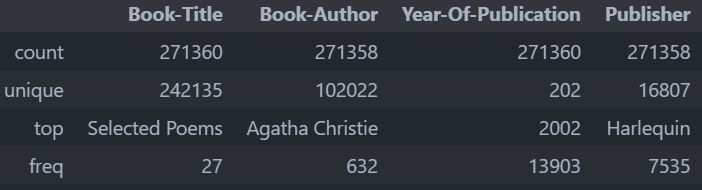
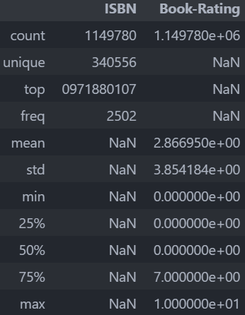
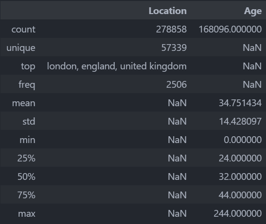
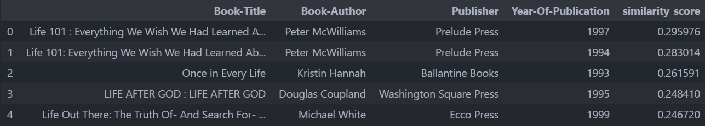

# Laporan Proyek Machine Learning - Anugerah Surya Atmaja

## Project Overview

Selama beberapa dekade terakhir, kehadiran platform digital besar seperti YouTube, Amazon, dan Netflix telah mengubah cara pengguna mengakses dan mengonsumsi informasi, produk, dan hiburan. Dalam lingkungan ini, sistem rekomendasi menjadi komponen inti yang menentukan keberhasilan dan kesesuaian pengguna pada platform tersebut. Sistem ini digunakan untuk menyarankan konten atau produk yang relevan dan dipersonalisasi sesuai preferensi pengguna [(Fanca et. Al, 2020)](https://doi.org/10.1109/ICCC49264.2020.9257290). Dengan tingkat persaingan yang tinggi di industri digital, efektivitas sistem rekomendasi bisa menjadi faktor penentu keunggulan kompetitif suatu perusahaan. Hal ini dikarenakan implementasi dari sistem rekomendasi yang tepat dapat meningkatkan pengalaman pengguna dalam menggunakan platform terkait [(Elumalai et Al., 2024))](https://doi.org/10.1109/ICSES63760.2024.10910717). Berdasarkan survei yang dilakukan mengenai pengaruh dari sistem rekomendasi terhadap pilihan pengguna, [(Thompson, 2008)](https://www.nytimes.com/2008/11/23/magazine/23Netflix-t.html) menyatakan bahwa 60% pilihan film pada Netflix didasari pada hasil rekomendasi. Selain itu, [(Lamere & Green, 2008)](http://developers.sun.com/learning/javaoneonline/2008/pdf/TS-5841.pdf) menyatakan bahwa 35% dari total penjualan Amazon berasal dari rekomendasi sistem.
Kondisi tersebut tentu menunjukkan peran dari sistem rekomendasi dalam meningkatkan pengalaman pengguna yang berujung pada peningkatan efektivitas dari suatu platform. Salah satu bentuk implementasi yang semakin berkembang adalah sistem rekomendasi buku, yang digunakan untuk menyarankan judul-judul bacaan yang sesuai dengan minat dan riwayat pembacaan pengguna. Sistem ini tidak hanya mempertimbangkan genre dan penulis favorit, tetapi juga pola interaksi pengguna terhadap buku-buku tertentu, seperti penilaian, ulasan, dan riwayat pencarian. Dalam ekosistem digital seperti toko buku daring, perpustakaan digital, dan platform literasi, sistem rekomendasi buku berperan penting dalam membantu pengguna menemukan bacaan yang relevan dan memperkaya pengalaman literasi secara keseluruhan.

## Business Understanding

Berdasarkan latar belakang yang dijelaskan, dapat diidentifikasi masalah penelitian sebagai berikut.

### Problem Statements

- Kesulitan dalam menyajikan rekomendasi buku yang relevan bagi pengguna baru disebabkan oleh kurangnya data preferensi atau riwayat interaksi pengguna.
- Kurangnya pemanfaatan data kolektif dari pengguna lain yang memiliki minat serupa menyebabkan sistem rekomendasi tidak optimal dalam menyesuaikan saran buku dengan preferensi pengguna.
- Terbatasnya akurasi dan personalisasi dalam sistem rekomendasi buku disebabkan oleh pendekatan yang hanya mengandalkan satu jenis data, baik dari sisi konten maupun perilaku pengguna.

### Goals

Masalah yang didefinisikan akan diselesaikan dengan target penelitian sebagai berikut.

- Menyediakan rekomendasi buku yang relevan bagi pengguna baru dengan memanfaatkan informasi konten buku.
- Meningkatkan kualitas rekomendasi buku dengan mengoptimalkan pemanfaatan pola interaksi dan preferensi pengguna lain yang memiliki kesamaan minat.
- Menggabungkan informasi konten buku dan perilaku pengguna untuk membangun sistem rekomendasi buku yang lebih personal dan akurat.

### Solution statements
- Dalam membentuk sistem rekomendasi yang memanfaatkan relevansi konten yang diinginkan dengan informasi konten yang tersedia akan digunakan metode **Content Based Filtering**.
- Dalam membentuk sistem rekomendasi yang memanfaatkan preferensi pengguna lain berupa rating serta ISBN buku, maka digunakan metode Collaborative Filtering.

## Data Understanding
Data yang digunakan dalam penelitian ini diperoleh dari Platform Kaggle bernama ***Book Recommendation Dataset*** [(Ziegler, 2004)](https://www.kaggle.com/datasets/arashnic/book-recommendation-dataset). Dataset ini terdiri dari 3 subset data, di mana terdapat data **Books**, **Ratings**, dan **Users**. Data Books memiliki 271360 Observasi yang memiliki rincian kolom sebagai berikut.
- ISBN **(Primary Key)** : Kode unik Buku (International Standard Book Number). Kode ini menjadi kode yang menghubungkan dataset ini dengan dataset **Ratings**.
- Book Title : Judul Buku
- Book Author : Penulis Buku
- Year of Publication : Tahun Buku dipublikasi
- Publisher : Lembaga yang Mempublikasi Buku
- Image URL S : Link cover Buku berukuran Small
- Image URL M : Link cover Buku berukuran Medium
- Image URL L : Link cover Buku berukuran Large

Data Ratings memiliki 1149780 observasi yang memiliki rincian kolom sebagai berikut. (Primary Key pada dataset ini adalah UserID dan ISBN, sehingga untuk pasangan UserID dan ISBN akan bersifat Unik.)
- User ID **(Foreign Key)** : ID User yang memberikan rating pada Buku tertentu.
- ISBN **(Foreign Key)** : Kode Buku yang diberikan Rating.
- Book Rating : Rating yang diberikan terhadap Buku dalam rentang 0 - 10.

Data Users memiliki 278858 observasi yang memiliki rincian kolom sebagai berikut.
- User ID **(Primary Key)** : ID dari User yang menjadi Primary Key dataset ini.
- Location : Lokasi dari user.
- Age : Usia dari User

Untuk mempermudah dalam mengakses kolom pada data yang akan dieksplorasi, dilakukan penamaan ulang untuk kolom User-ID agar tidak terkendala dalam mengakses variabel yang mengandung tanda strip. Sehingga data User dan data Rating karena mengandung kolom tersebut, kolomnya diubah namanya menjadi userID. Selanjutnya, dalam memahami kondisi dari data untuk karakteristik yang unik, diperoleh keterangan berikut.

Banyak User :  278858 
Banyak Buku :  271360 
Banyak User yang Memberi Rating :  105283 
Terlihat bahwa dari 278858 user yang teridentifikasi, jumlah user yang memberi rating sebanyak 105283 pengguna. Selain itu jumlah buku yang tersedia sebanyak 271360 Buku. Hal ini menunjukkan bahwa tidak semua pengguna memberikan umpan balik berupa rating terhadap buku yang pernah mereka beli. Dalam memperoleh ringkasan statistik untuk ketiga dataset yang digunakan, dihitung ukuran pemusatan dan ukuran dispersi dari data tersebut.

<figure>
  
  <figcaption><b>Gambar 1.</b> Ringkasan Statistik Data Books</figcaption>
</figure> 

Berdasarkan Gambar 1 terlihat bahwa Buku yang paling banyak muncul berjudul "Selected Poems". Selain itu, penulis yang sering merilis buku yang dipublikasikan adalah "Agatha Cristie" yaitu sebanyak 632 kali tercatat. Secara rata-rata, buku yang tercatat didominasi pada tahun perilisan 2002 yaitu sebanyak 13903 buku. Publisher buku terbanyak adalah "Harlequin".
 

<figure>
  
  <figcaption><b>Gambar 2.</b> Ringkasan Statistik Data User</figcaption>
</figure> 

Berdasarkan Gambar 2 dapat diperoleh bahwa Buku yang paling sering diberi rating adalah buku dengan ISBN "0971880107". Selain itu, secara rata-rata, rating pada dataset itu adalah 2,86. Nilai ini menunjukkan rataan yang rendah karena rentang rating adalah 0 - 10.
 
<figure>
  
  <figcaption><b>Gambar 3.</b> Ringkasan Statistik Data Rating</figcaption>
</figure>

Berdasarkan Gambar 3 diperoleh user yang tercatat didominasi dari user yang berasal dari London, England, United Kingdom yaitu sebanyak 2506 user. Selain itu, rata-rata user yang tercatat berusia 34 Tahun dengan standar deviasi 14. Nilai simpangan tersebut menunjukkan variasi yang cukup tinggi pada data, sehingga menggambarkan usia yang membeli buku cenderung merata namun secara umum didominasi pada usia Remaja hingga Dewasa.  

Untuk memastikan data yang digunakan sudah dalam kondisi *clean*, dilakukan identifikasi *missing value* pada setiap dataset. Berdasarkan pengecekan tersebut, diperoleh terdapat missing value pada beberapa data. Pada dataset Buku terlihat terdapat missing value pada data yaitu pada kolom Age sebanyak 110762 observasi. Hal ini menunjukkan diperlukan perlakuan agar tidak mengganggu analisis selanjutnya. Pada dataset Buku terlihat terdapat missing value pada data yaitu pada kolom Book-Author sebanyak 2 observasi, Publisher sebanyak 2 observasi, dan Image-URL-L sebanyak 3 observasi. Hal ini juga menunjukkan diperlukan perlakuan agar tidak mengganggu analisis selanjutnya. Pada dataset Rating tidak terdapat missing value.

## Data Preparation
Pada tahapan persiapan data terdapat beberapa teknik yang dilakukan. Dalam mempermudah analisis, dilakukan pengintegrasian ketiga dataset melalui proses Join Tabel. Ketiga dataset digabungkan secara bertahap menggunakan primary serta foreign key yang ditetapkan sebelumnya. Berdasarkan proses joining tersebut, diperoleh tabel baru dengan jumlah observasi sebanyak 1149780 observasi. Namun, karena jumlah data pada masing-masing dataset tidak sama, sehingga terdapat missing value pada dataset hasil gabungan.

**Tabel 1. Jumlah Missing Values pada Setiap Kolom Dataset Books**

| Kolom                 | Jumlah Missing Values |
|-----------------------|-----------------------|
| userID                | 0                     |
| ISBN                  | 0                     |
| Book-Rating           | 0                     |
| Location              | 0                     |
| Age                   | 309492                |
| Book-Title            | 118644                |
| Book-Author           | 118646                |
| Year-Of-Publication   | 118644                |
| Publisher             | 118646                |
| Image-URL-S           | 118644                |
| Image-URL-M           | 118644                |
| Image-URL-L           | 118648                |

Berdasarkan Tabel 1 terlihat jumlah missing value yang cukup banyak. Dalam mengatasi *missing value* diberikan perlakuan berupa eliminasi observasi. Hal ini dipilih untuk meminimumkan bias hasil observasi karena intervensi dari perlakuan berupa imputasi.

Berkaitan dengan Skenario Pembentukan Sistem Rekomendasi dengan *Content Based Filtering* dan *Colaborative Filtering*. Dalam mempersiapkan data yang digunakan untuk pembentukan sistem rekomendasi dengan Content Based Filtering, dipilih atribut seperti Book Title, Book Author, dan Year of Publication sebagai konten yang dipertimbangkan. Ketiga atribut tersebut digabungkan menjadi 1 atribut baru bernama AtributBuku. Kolom AtributBuku dilakukan *preprocessing* berupa case folding dan menghilangkan tanda baca pada teks. Selanjutnya dilakukan undersampling pada dataset karena mempertimbangkan jumlah elemen yang digunakan untuk membentuk matriks cosine similarity (NxN) yang akan membebani komputasi saat nilai N besar. Pada penelitian ini dibatasi sebanyak 90000 observasi untuk pembentukan matriks cosine similarity, sehingga diperoleh matriks berukuran 90000 x 90000 -> sebanyak 8.100.000.000 elemen.

Mengacu pada karakteristik kolom AtributBuku yang dibentuk seharusnya unik pada data, sehingga perlu dilakukan penghapusan duplikasi jika nilai pada kolom tersebut terdapat kesamaan. Hal ini bertujuan agar tidak membentuk isian matriks yang sama pada matriks cosine similarity nantinya. Selain itu, dalam membentuk matriks cosine similarity, diperlukan penghitungan matriks yang akan menjadi pembobot setiap observasi yang akan diukur kesamaannya menggunakan cosine similarity. Pada penelitian ini, pembobot tersebut menggunakan vektor Term Frequency - Inverse Document Frequency. Vektor tersebut merupakan bentuk representasi fitur dari AtributBuku.

1. **TF-IDF:**

$$
\text{TF-IDF}(t, d, D) = \text{TF}(t, d) \times \text{IDF}(t, D)
$$

2. **Term Frequency (TF):**

$$
\text{TF}(t, d) = \frac{f_{t,d}}{\sum_{k} f_{k,d}}
$$

3. **Inverse Document Frequency (IDF):**

$$
\text{IDF}(t, D) = \log \left( \frac{N}{|\{ d \in D : t \in d \}|} \right)
$$

Keterangan:
- $t$ = term (kata)
- $d$ = dokumen
- $D$ = kumpulan dokumen
- $f_{t,d}$ = frekuensi kata $t$ dalam dokumen $d$
- $N$ = jumlah total dokumen

Dalam mempersiapkan data untuk pembentukan sistem rekomendasi dengan Collaborative Filtering, tahap *preprocessing* dimulai dengan membentuk Encoder dan Decoder (User -> Indeks -> User; ISBN -> Indeks -> ISBN).
Tahapan selanjutnya adalah mengacak dataset yang diindeks ulang sebelumnya agar tidak membentuk urutan tertentu. Hal ini digunakan karena tahapan splitting yang ditetapkan memperhatikan urutan data, di mana menggunakan proporsi 80 : 20 untuk data latih dan data uji. Variabel X menggunakan hasil encoding UserID dan ISBN, variabel Y merupakan hasil standardisasi rating pada skala 0 - 1.

Berdasarkan kedua proses preprocessing khusus yang dilakukan maka diperoleh *data clean* berjumlah dua yang akan diujikan terpisah berdasarkan metode yang digunakan.

## Modeling

### Content Based Filtering
Penelitian ini menggunakan pendekatan Content-Based Filtering (CBF) yang dikombinasikan dengan metode Cosine Similarity untuk memberikan rekomendasi. Content-Based Filtering merupakan salah satu teknik dalam sistem rekomendasi yang menganalisis karakteristik atau fitur dari item yang pernah disukai pengguna sebelumnya, lalu merekomendasikan item dengan fitur serupa. Sistem ini melakukan pencocokan antara profil pengguna dan fitur item untuk menghasilkan rekomendasi yang dipersonalisasi.

Tahapan dalam pembentukan sistem rekomendasi sebagai berikut.

- Ekstraksi fitur dari setiap item.
- Representasi item dan/atau pengguna dalam bentuk vektor fitur menggunakan TF-IDF
- Penghitungan kesamaan antara vektor item dan profil pengguna.
- Rekomendasi diberikan berdasarkan tingkat kemiripan tertinggi.

TF-IDF digunakan sebagai vektor representasi fitur untuk atribut buku. 

#### Cosine Similarity
Cosine Similarity digunakan untuk mengukur kesamaan antar dua vektor. Cosine similarity dihitung antara vektor TF-IDF yang dibentuk sebelumnya.

**Rumus:**

$$
\text{Cosine Similarity}(A, B) = \frac{\sum_{i=1}^{n} A_i \cdot B_i}{\sqrt{\sum_{i=1}^{n} A_i^2} \cdot \sqrt{\sum_{i=1}^{n} B_i^2}}
$$

Berdasarkan hasil yang diperoleh nantinya akan terbentuk vektor cosine similarity yang akan digunakan untuk menjadi referensi kesamaan antara sebuah input Judul Buku dengan buku-buku lain yang ada pada Data. Dalam memperoleh hal tersebut, dibentuk sebuah fungsi untuk mengembalikan rekomendasi berdasarkan judul yang diinputkan sebanyak 5 rekomendasi teratas berdasarkan nilai cosine similarity tertinggi.
Pada pengujian tersebut, diberikan judul 'Life in the Rainforests (Life in the Series)' yang digunakan sebagai input ke fungsi. Terlihat bahwa fungsi mengembalikan 5 buku yang memiliki similarity tertinggi dengan judul sebelumnya. Terlihat pada Gambar 4, Nilai cosine similarity tertinggi yaitu 0,29 pada buku berjudul Life 101 : Everything We Wish We Had Learned A yang ditulis oleh author Peter McWilliams. Kesamaan judul ini dapat menjadi penyebab buku tersebut menjadi hasil kembalian fungsi. Hal ini dikarenakan pengujian kesamaan mempertimbangkan judul, author, dan tahun publikasi. Namun, nilai yang rendah dapat disebabkan karena jumlah token yang sama tidak terlalu banyak terhadap judul.

<figure>
  
  <figcaption><b>Gambar 4.</b> Hasil Rekomendasi dengan Content-Based Filtering</figcaption>
</figure> 

### Colaborative Filtering

#### RecommenderNet

Model RecommenderNet yang dibangun berbasis Neural Network sehingga terdapat beberapa layer NN. Pembentukan model melibatkan pendefinisian vektor embedding dari User dan Buku. Selain itu terdapat layer Dropout, Fully Connected Layer, dan Batch Normalization yang didefinisikan pada arsitektur model. Layer terakhir menggunakan fungsi aktivasi Sigmoid yang memiliki output 1 nilai. 

Pada model yang digunakan, didefinisikan nilai vektor Embedding sebanyak 1024 elemen. Hal ini bertujuan untuk memaksimalkan fitur yang dapat ditangkap oleh model dari karakteristik user pada data. Selain itu model yang digunakan menggunakan optimizer Adam dengan learning rate 0.00001. Dari eksplorasi yang digunakan juga ditetapkan pelatihan akan menggunakan 10 epoch, karena nilai yang lebih besar menunjukkan peningkatan pada loss untuk data validasi sehingga mengindikasikan model overfitting. Penelitian ini juga menggunakan Batch Size sebesar 1024 untuk memaksimumkan performa komputasi sehingga pelatihan lebih cepat dilakukan. Selain itu, penggunaan batch size yang lebih besar juga dapat meminimumkan loss yang dihasilkan oleh model dalam proses pelatihan, dimana loss menggunakan Mean Squared Error dengan metrik evaluasi menggunakan Root Mean Squared Error.

<figure>
  
  <figcaption><b>Gambar 5.</b> Kurva Pelatihan RecommenderNet</figcaption>
</figure> 

Pada Gambar 5, terlihat kurva pembelajaran model RecommenderNet cenderung overfitting. Hal ini menunjukkan bahwa model yang dibangun butuh optimasi sehingga dapat memperoleh hasil yang lebih baik. Hal ini juga dapat terjadi ketika variabel prediktor memiliki hubungan yang sangat kecil terhadap variabel target. 

<figure>
  
  <figcaption><b>Gambar 6.</b> Hasil Rekomendasi dengan Colaborative Filtering Menggunakan RecommenderNet</figcaption>
</figure>

Pada pengujian yang dilakukan, diberikan inputan user dengan ID 276727. Berdasarkan user tersebut, diberikan rekomendasi buku seperti yang terlihat pada Gambar 6. Hasil keluaran dari fungsi tersebut berkaitan dengan preferensi pengguna yang memiliki karakteristik sama. Sistem merekomendasikan user tersebut untuk membeli buku Femmes Fatal, karena memberikan hasil prediksi rating tertinggi. Kondisi ini menunjukkan bahwa sistem memperkirakan bahwa user tersebut akan memberi rating yang tinggi mengacu pada pola interaksi pengguna lain yang mirip. Sehingga sistem merekomendasikan buku berdasarkan user lain yang karakteristiknya mirip serta menyukai daftar buku tersebut.

#### CatBoost

Pembentukan model ini digunakan untuk memberikan pendekatan lain berbasis machine learning yaitu Algoritma CatBoost. Pelatihan menggunakan variabel prediktor dan target yang sama dengan RecommenderNet sebelumnya. Dalam mengoptimalkan model CatBoost yang akan dibangun, digunakan library Optuna untuk hyperparameter tuning algoritma tersebut. Hal ini digunakan untuk menemukan kombinasi hyperparameter yang sesuai dengan model.

<figure>
  
  <figcaption><b>Gambar 7.</b> Hasil Rekomendasi dengan Colaborative Filtering Menggunakan CatBoost</figcaption>
</figure>

Pada pengujian yang dilakukan, diberikan inputan user dengan ID 276727. Berdasarkan user tersebut, diberikan rekomendasi buku seperti yang terlihat pada Gambar 7. Hasil keluaran dari fungsi tersebut berkaitan dengan preferensi pengguna yang memiliki karakteristik sama. Sistem merekomendasikan user tersebut untuk membeli buku Verlorene Sellen, Firechild, hingga To Fear The Light. Hal ini dikarenakan return predicted rating yang tinggi untuk daftar tersebut. Kondisi ini menunjukkan bahwa sistem memperkirakan bahwa user tersebut akan memberi rating yang tinggi mengacu pada pola interaksi pengguna lain yang mirip. Sehingga sistem merekomendasikan buku berdasarkan user lain yang karakteristiknya mirip serta menyukai daftar buku tersebut.

## Evaluation

Dalam mengevaluasi ketiga mekanisme yang digunakan meliputi Content Based Filtering menggunakan Cosine Similarity serta Colaborative Filtering menggunakan RecommenderNet dan Algoritma Catboost, menggunakan evaluasi dengan Precision, Recall, F-1 Score, dan Hit Rate. Tujuan evaluasi tersebut adalah mengukur kebenaran dari hasil prediksi terhadap data aktual seseorang user.

Jika user pernah membeli buku A, B, C, dan D, maka nilai tersebut digunakan sebagai nilai aktual, dengan asumsi bahwa user akan membeli sesuatu dengan preferensi yang sama. Hasil rekomendasi akan disesuaikan dengan data tersebut.

**Precision**  
Precision mengukur proporsi item yang *direkomendasikan dan relevan* terhadap semua item yang direkomendasikan.  
Rumus:  
$$
\text{Precision} = \frac{|\text{Relevant} \cap \text{Recommended}|}{|\text{Recommended}|}
$$

**Recall**  
Recall mengukur proporsi item *relevan* yang berhasil direkomendasikan terhadap semua item relevan.  
Rumus:  
$$
\text{Recall} = \frac{|\text{Relevant} \cap \text{Recommended}|}{|\text{Relevant}|}
$$

**F1 Score**  
F1 Score adalah rata-rata harmonis antara Precision dan Recall. Cocok saat ingin menyeimbangkan keduanya.  
Rumus:  
$$
\text{F1} = 2 \cdot \frac{\text{Precision} \cdot \text{Recall}}{\text{Precision} + \text{Recall}}
$$

**Hit Rate**  
Hit Rate menunjukkan apakah ada *setidaknya satu* item relevan dalam hasil rekomendasi.  
Rumus:  
$$
\text{HitRate} =
\begin{cases}
1, & \text{jika } |\text{Relevant} \cap \text{Recommended}| > 0 \\
0, & \text{jika tidak}
\end{cases}
$$

Berdasarkan ukuran evaluasi yang didefinisikan, kedua sistem rekomendasi yang dibangun dievaluasi untuk mengetahui seberapa baik sistem dapat memberikan rekomendasi pengguna berdasarkan konten yang serupa ataupun preferensi pengguna lain yang mirip. 
Pada Content Based Filtering, sistem dievaluasi terhadap 10 pengguna diperoleh ukuran evaluasi rata-rata sebagai berikut.

Avg Precision@5: 0.0200 
Avg Recall@5: 0.0200 
Avg F1-Score@5: 0.0200 
Avg Hit Rate@5: 0.1000 

Pada Collaborative Filtering menggunakan RecommenderNet dan Algoritma Catboost, model dievaluasi terhadap pengguna yang didefinisikan pada validation set, diperoleh evaluasi sebagai berikut.

=====Recommender Net====

Avg Precision@5: 0.0000 
Avg Recall@5: 0.0000 
Avg F1-Score@5: 0.0000 
Avg Hit Rate@5: 0.0000 
RMSE: 0.3754

=====CatBoost=====

Avg Precision@5: 0.0000 
Avg Recall@5: 0.0000 
Avg F1-Score@5: 0.0000 
Avg Hit Rate@5: 0.0000 
RMSE: 0.3741

Berdasarkan kedua jenis sistem rekomendasi yang dibangun, terlihat model masih belum cukup baik untuk memberikan rekomendasi pada user, namun sudah memiliki keterkaitan dengan konsep yang digunakan. Hal ini dapat dilihat pada Content Based Filtering, hasil return untuk input user pada judul atau author buku tertentu sesuai dengan hasil yang diharapkan. Kondisi yang membuat evaluasi kecil dapat terjadi karena terdapat kecenderungan data user yang membeli buku secara acak, bukan berdasarkan kesamaan karakteristiknya.

Selain itu pada Collaborative filtering diperoleh bahwa CatBoost memiliki performa sistem rekomendasi yang lebih baik dibandingkan dengan sistem rekomendasi yang dihasilkan RecommenderNet. Hal ini menunjukkan bahwa Machine Learning tidak selalu lebih buruk performanya dibanding Deep Learning pada dataset yang besar.

Secara keseluruhan, sistem yang dibangun sudah dapat menjawab masalah penelitian dengan membangun sistem rekomendasi yang sesuai untuk user dalam menemukan buku di platform Amazon. Selain itu, penelitian ini juga membuktikan bahwa pemanfaatan data historis dapat menjadi acuan dalam menemukan rekomendasi yang tepat untuk pengguna. Kedepannya, diharapkan sistem ini dapat dikembangkan dengan data yang lebih banyak untuk dapat menjawab tantangan yang dapat muncul.

## Reference

1. Fanca, A., Puscasiu, A., Gota, D.-I., & Valean, H. (2020). Recommendation systems with machine learning. In 2020 21st International Carpathian Control Conference (ICCC) (pp. 1–6). IEEE. https://doi.org/10.1109/ICCC49264.2020.9257290

2. Elumalai, G., Nune, V. L. M., Venuturumilli, M., Parmar, P. L., Rajlakshmi, P. V., & Chandrasekar, T. (2024). Improving user experience in movie recommendations using machine learning. In 2024 International Conference on Innovative Computing, Intelligent Communication and Smart Electrical Systems (ICSES) (pp. 1–7). IEEE. https://doi.org/10.1109/ICSES63760.2024.10910717

3. Lamere, P., & Green, S. (2008). Project Aura: Recommendation for the rest of us [Conference presentation]. Sun JavaOne Conference. http://developers.sun.com/learning/javaoneonline/2008/pdf/TS-5841.pdf

4. Thompson, C. (2008, November 21). If you liked this, you’re sure to love that. The New York Times. https://www.nytimes.com/2008/11/21/opinion/21thompson.html

5. Ziegler, C.-N. (2004). Book-Crossing dataset [Data set]. Humankind Systems. Collected August–September 2004 from the Book-Crossing community, with permission from Ron Hornbaker (CTO). Contains 278,858 anonymized users and 1,149,780 ratings of 271,379 books. Data was preprocessed and cleaned by the author of this work. https://www.kaggle.com/datasets/arashnic/book-recommendation-dataset

